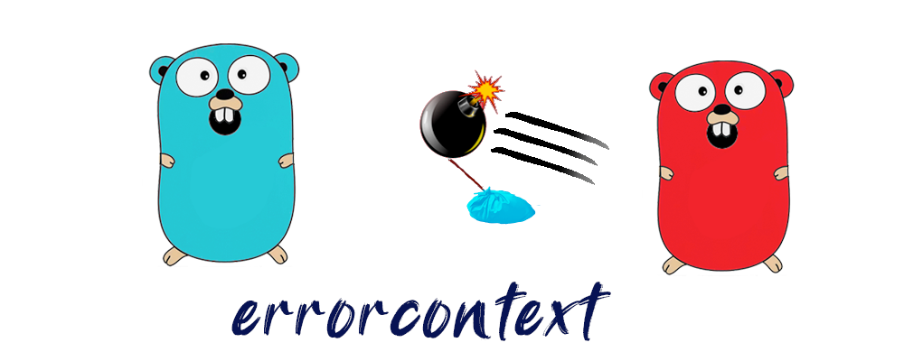

<div align="center" style="margin-bottom:20px">
  
  <div align="center">
    <a href="https://github.com/blugnu/errorcontext/actions/workflows/pipeline.yml"></a>
    <a href="https://goreportcard.com/report/github.com/blugnu/errorcontext" ></a>
    <a>= 1.14" src="https://img.shields.io/github/go-mod/go-version/blugnu/errorcontext?style=flat-square"/></a>
    <a href="https://github.com/blugnu/errorcontext/blob/master/LICENSE"></a>
    <a href="https://coveralls.io/github/blugnu/errorcontext?branch=master"></a>
    <a href="https://pkg.go.dev/github.com/blugnu/errorcontext"></a>
  </div>
</div>


> **TL;DR**: to get started, `go get github.com/blugnu/errorcontext@v0.2.0` (or later, if available)

> **NOTE:** _the original incarnation of this module was one of the first that I released publicly and I made some mistakes_. _This resulted in problems with version `v0.1.0` already cached in the golang ecosystem.  The first useable version of this module is therefore `v0.2.0`.<br/>:blush:_

A `go` package providing an `error` implementation that wraps an `error` together with a supplied `Context`.

A number of factory functions are provided to create/wrap contextual errors in a variety of circumstances:

| function | description |
| -- | -- |
| `New(ctx, s)` | creates a new error using `errors.New()` given a string |
| `Errorf(ctx, format, args...)` | creates a new error using `fmt.Errorf()` given a format string and args |
| `Wrap(ctx, err)` | creates an error that wraps an existing error |

All functions require a `Context`, to be associated with the `error`.

## Creating Errors

### _example: New()_
```golang
    if len(sql) == 0 {
        return errorcontext.New(ctx, "a sql statement is required")
    }
```

### _example: Errorf()_
_1. formatting a new error_
```golang
    if len(pwd) < minpwdlen {
        return errorcontext.Errorf(ctx, "password must be at least %d chars", minpwdlen)
    }
```
_2. wrapping an existing error with textual context_
```golang
    if err := db.QueryContext(ctx, sql, args); err != nil {
        return errorcontext.Errorf(ctx, "db query: %w", err)
    }
```

### _example: Wrap()_
```golang
    if err := db.QueryContext(ctx, sql, args); err != nil {
        return errorcontext.Wrap(ctx, err)
    }
```

## Working With Errors

Any associated `context` is obtained from an error (if required) by determining whether an error is (or wraps) an `ErrorWithContext`.  If an `ErrorWithContext` is available, the `Context()` function may then be called to obtain the `Context` associated with the error:

```golang
ctx := context.Background()

// ...

if err := Foo(ctx); err != nil {
    ctx := ctx // shadow ctx for the context associated with the error
    ewc := ErrorWithContext{}
    if errors.As(err, &ewc) {
        ctx = ewc.Context()
    }
    log := logger.FromContext(ctx)
}
```

The `errorcontext.From()` helper function provides a convenient way to do this, accepting a default `Context` (usually the current context) to use if no `Context` is captured by the `error`:

```golang
    if err := SomeFooService(ctx, fooId); err != nil {
        ctx := errorcontext.From(ctx, err)
        log := logger.FromContext(ctx)
        log.Error(err)
        return
    }
```
> _**NOTE:** The `Context()` function recursively unwraps any further `ErrorWithContext` errors in order to return the `Context` associated with the most-wrapped error possible.  This ensures that the most enriched `Context` that is available is returned._

<br>

# Intended Use

`ErrorWithContext` is intended to reduce "chatter" when logging errors, particularly when using a context logger to enrich structured logs.

<br>

## The Problem

1. A `Context` enriched by a call hierarchy is _most_ enriched at the deepest levels of a call hierarchy.
2. Idiomatically wrapped errors provide the greatest narrative at the shallowest level of that call hierarchy.

This is perhaps best illustrated with an example:

```golang
func Bar(ctx context.Context) error {
    return errors.New("not implemented")
}

func Foo(ctx context.Context, arg int) error {
    ctx := context.WithValue(ctx, fooKey, arg)
    if err := Bar(ctx, arg * 2); err != nil {
        return fmt.Errorf("Bar: %w", err)
    }
    return nil
}

func main() {
    ctx := context.Background()
    if err := Foo(ctx, 42); err != nil {
        log.Fatalf("Foo: %s", err)
    }
}
```

This produces the output:

> `FATAL message="Foo: Bar: not implemented"`

i.e. the error `string` describes the origin of the error.  However, the `Context` available at the point at which the error is logged contains none of the keys which might be used by a context logger to enrich a log entry with additional information not available in the error string.

If a context logger is used to log an error with that enrichment, deep within the call hierarchy, the error string lacks the additional narrative obtained by passing the error back up the call hierarchy.  But if every function that receives an error does this then the log becomes very noisy and potentially confusing if context logging is not consistently used:

```golang
func Bar(ctx context.Context) error {
    log.Error("not implemented")
    return errors.New("not implemented")
}

func Foo(ctx context.Context, arg int) error {
    ctx := context.WithValue(ctx, fooKey, arg)
    if err := Bar(ctx, arg * 2); err != nil {
        log := logger.FromContext(ctx)
        log.Errorf("Bar: %s", err)
        return fmt.Errorf("Bar: %w", err)
    }
    return nil
}

func main() {
    ctx := context.Background()
    if err := Foo(ctx, 42); err != nil {
        log.Fatalf("Foo: %s", err)
    }
}
```

Which might produce log output similar to: 
> `ERROR message="not implemented"`<br/> `ERROR foo=42 message="Bar: not implemented"`<br/> `FATAL message="Foo: Bar: not implemented"`

_yes, there is a lot else wrong with the error handling and reporting in this example; it is intended only as an illustration and as such deliberately presents a potential worst case_

<br/>

`ErrorWithContext` addresses this dilemma by providing a mechanism for returning the context at each level back _up_ the call hierarchy together with the error.

A simple convention then ensures that the error is logged _only once_ **and** with the greatest possible context information available from the source of the error.

The convention has two parts:

1. If an error is returned, it is _**not** logged_ but returned as an _`ErrorWithContext`_ (if a local `Context` is available, or returned without context otherwise)
2. If an error is _**not**_ returned (usually at the effective or actual root of the call hierarchy) it is logged, extracting any `Context` from the `error` and using a context logger initialized from that context

Informational and warning logs may of course continue to be emitted at every level in the call hierarchy.

Applying this convention to the previous example illustrates the benefits:

```golang
func Bar(ctx context.Context) error {
    log.Error("not implemented")
    return errorcontext.New(ctx, "not implemented")
}

func Foo(ctx context.Context, arg int) error {
    ctx := context.WithValue(ctx, fooKey, arg)
    if err := Bar(ctx, arg * 2); err != nil {
        return errorcontext.Errorf("Bar: %w", err)
    }
    return nil
}

func main() {
    ctx := context.Background()
    if err := Foo(ctx, 42); err != nil {
        ctx := errorcontext.From(err)
        log := logger.FromContext(ctx)
        log.Fatalf("Foo: %s", err)
    }
}
```

which might result in output similar to:

> `FATAL foo=42 message="Foo: Bar: not implemented"`

Error handling is simplified and idiomatic, with the benefit of both fully enriched context logging _and_ descriptive error messages.